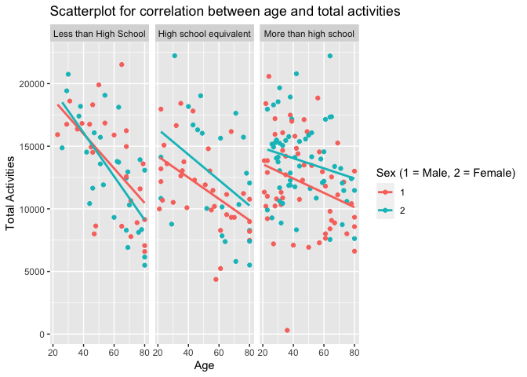
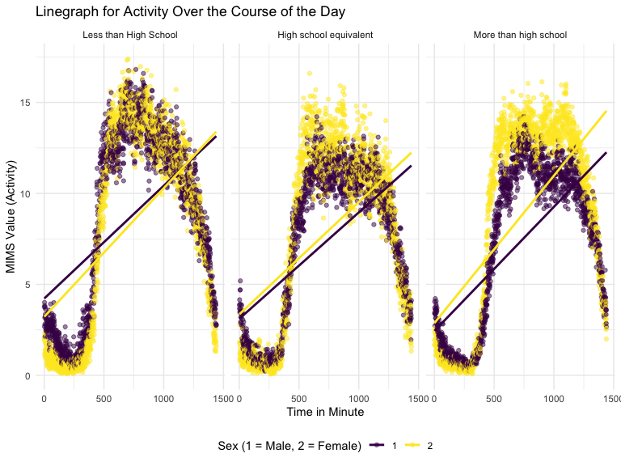

p8105_hw3_zx2482
================
Allison Xia
2023-10-11

## Problem 2

``` r
data("brfss_smart2010") 

brfss_smart2010 = 
  brfss_smart2010 |> 
  as_tibble()
```

``` r
brfss_overall_health =
  brfss_smart2010 |> 
  rename(state = Locationabbr,
         location = Locationdesc) |> 
  janitor::clean_names() |> 
  filter(topic == "Overall Health") |> 
  filter(response  %in% c("Excellent","Very good","Good","Fair","Poor")) |> 
  arrange(desc(response)) |> 
  mutate(response = ordered(response, levels = c("Poor", "Fair", "Good","Very good","Excellent"))) |> 
  arrange(response) 
```

#### In 2002, which states were observed at 7 or more locations? What about in 2010?

``` r
states_2002 <- 
  brfss_overall_health |> 
  filter(year == "2002") |> 
  group_by(state) |> 
  summarize(number_locations= n_distinct(location)) |> 
  filter(number_locations >= 7) |> 
  pull(state)

states_2010 <- 
  brfss_overall_health |> 
  filter(year == "2010") |> 
  group_by(state) |> 
    summarize(number_locations = n_distinct(location)) |> 
  filter(number_locations >= 7) |> 
  pull(state)
```

In 2002, these following states were observed at 7 or more locations:
CT, FL, MA, NC, NJ, PA. In 2010, these following states were observed at
7 or more locations: CA, CO, FL, MA, MD, NC, NE, NJ, NY, OH, PA, SC, TX,
WA

#### Construct a dataset that is limited to Excellent responses, and contains, year, state, and a variable that averages the data_value across locations within a state. Make a “spaghetti” plot of this average value over time within a state (that is, make a plot showing a line for each state across years – the geom_line geometry and group aesthetic will help).

``` r
brfss_excellent = 
  brfss_overall_health |> 
  filter(response == "Excellent") |> 
  group_by(state, year) |> 
  summarize (mean_data_value = mean(data_value, na.rm=TRUE))
```

    ## `summarise()` has grouped output by 'state'. You can override using the
    ## `.groups` argument.

``` r
ggplot(brfss_excellent, aes(x=year, y=mean_data_value, color=state)) +
  geom_line() +
  labs(title="Data average value over years within a state",
       x="Year",
       y="Mean Data Value")
```


#### Make a two-panel plot showing, for the years 2006, and 2010, distribution of data_value for responses (“Poor” to “Excellent”) among locations in NY State.

``` r
brfss_NY_responses = 
  brfss_overall_health |> 
  filter(state == "NY" & (year =="2006" | year == "2010"))
```

``` r
ggplot(brfss_NY_responses, aes(x= response, y = data_value))+
  geom_boxplot(fill="skyblue", color="black")+
  labs(title="Boxplot showing distribution of data value for responses", x="Responses", y="Data Value") +
  facet_wrap(~year)
```


## Problem 3

#### Load, tidy, merge, and otherwise organize the data sets

``` r
accelerometer = read_csv("./accelerometer.csv")
```

    ## Rows: 250 Columns: 1441
    ## ── Column specification ────────────────────────────────────────────────────────
    ## Delimiter: ","
    ## dbl (1441): SEQN, min1, min2, min3, min4, min5, min6, min7, min8, min9, min1...
    ## 
    ## ℹ Use `spec()` to retrieve the full column specification for this data.
    ## ℹ Specify the column types or set `show_col_types = FALSE` to quiet this message.

``` r
demographic = read_csv("./demographic.csv",skip =4)
```

    ## Rows: 250 Columns: 5
    ## ── Column specification ────────────────────────────────────────────────────────
    ## Delimiter: ","
    ## dbl (5): SEQN, sex, age, BMI, education
    ## 
    ## ℹ Use `spec()` to retrieve the full column specification for this data.
    ## ℹ Specify the column types or set `show_col_types = FALSE` to quiet this message.

``` r
demographic_tidy =
  demographic |> 
  janitor::clean_names() |> 
  na.omit() |> 
  filter(age >= 21) |> 
  mutate(sex = factor(sex),
         education = factor(education))
```

``` r
accelerometer_tidy=
  accelerometer |> 
  janitor::clean_names() |> 
  pivot_longer(
    min1:min1440, 
    names_to = "min",
    names_prefix = "min",
    values_to = "mims"
  ) |> 
  mutate(min = as.numeric(min))
```

``` r
nhanes = demographic_tidy |> 
  left_join(accelerometer_tidy,by = join_by(seqn))
```

#### Produce a reader-friendly table for the number of men and women in each education category, and create a visualization of the age distributions for men and women in each education category. Comment on these items

``` r
sex_education = 
  demographic_tidy |> 
  group_by(sex, education) |>
  summarize(count = n())|>
  mutate(sex = recode(sex, "1" = "Male", "2" = "Female"),
         education = recode(education, "1" = "Less than High School", "2" = "High school equivalent", "3"="More than high school"))
```

    ## `summarise()` has grouped output by 'sex'. You can override using the `.groups`
    ## argument.

``` r
sex_education |> 
  knitr::kable(digits = 2) 
```

| sex    | education              | count |
|:-------|:-----------------------|------:|
| Male   | Less than High School  |    27 |
| Male   | High school equivalent |    35 |
| Male   | More than high school  |    56 |
| Female | Less than High School  |    28 |
| Female | High school equivalent |    23 |
| Female | More than high school  |    59 |

- Both males and females have the highest count in the “More than high
  school” education level. For males, the number of participants
  increases with each increase in education level. For females, there
  are more participants with “Less than High School” education compared
  to those with a “High school equivalent”. In the “More than high
  school” category, females (59) slightly outnumber males 56). In
  contrast, males (35) have more participants than females
  (`sex_education |> filter(sex == "Female" & education == "High school equivalent") |>pull(count)`)
  in the “High school equivalent” category.

``` r
my_labels<- c("1" = "Less than High School", "2" = "High school equivalent", "3"="More than high school")

ggplot(demographic_tidy, aes(x = sex, y = age)) +
  geom_boxplot(fill="skyblue", color="black") +
  facet_wrap(~education,labeller = labeller(.default = my_labels))+
  labs(title="Boxplot of age distribution for women and men in each education category", x=" Sex (1 = Male, 2 = Female) ", y="Age")
```


This boxplot shows age distribution for men and women in each eduation
category.The median age for participants with an education
`Less Than High School` is 60 for men, and 61 for women. Both
distributions in `Less Than High School` category are right-skewed. The
median age for participants with an education `High school equivalent`
is 53 for men, and 62 for women. Both distributions in
`High school equivalent` category are right-skewed.The median age for
participants with an education `More than high school` is 43.5for men,
and 41 for women. Both distributions in `More than high school` category
are left-skewed.

#### Using your tidied dataset, aggregate across minutes to create a total activity variable for each participant. Plot these total activities (y-axis) against age (x-axis); your plot should compare men to women and have separate panels for each education level. Include a trend line or a smooth to illustrate differences. Comment on your plot.

``` r
nhanes_total_activities = 
  nhanes |> 
  group_by(seqn) |> 
  mutate(total_activity = sum(mims)) |> 
  select(seqn, age, education, sex, total_activity) |> 
  distinct()
```

``` r
ggplot(nhanes_total_activities, aes(x = age, y = total_activity, color = sex))+
  geom_point()+
  facet_wrap(~education,labeller = labeller(.default = my_labels))+
  geom_smooth(method="lm", se=FALSE)+
  labs(title="Scatterplot for correlation between age and total activities", x="Age", y="Total Activities", color = "Sex (1 = Male, 2 = Female)")
```

    ## `geom_smooth()` using formula = 'y ~ x'


\* This scatterplot shows the relationship between total activities and
age, bifurcated by gender, and further categorized into three tabs based
on educational attainment: ‘Less than High School’, ‘High School
Equivalent’, and ‘More than High School’. \* A discernible trend across
all categories and genders indicates a negative correlation between
total activities and age. Participants with an education ‘Less than High
School’ start with highest activities when young but shows the steepest
decline in total activities as they age when compared to other education
categories. Participants with an education `Equivalent to High School`
show the second steepest decline and those with an education
`More than High School` show the most gradual decline in activities with
age. \* The slope of the decline in total activities with age is similar
for both males and females.In the ‘High School Equivalent’ and ‘More
than High School’ categories, females demonstrate higher total
activities across all ages compared to their male counterparts. In the
‘Less than High School’ category, total activities for males and females
are relatively the same across the age spectrum.

#### Accelerometer data allows the inspection activity over the course of the day. Make a three-panel plot that shows the 24-hour activity time courses for each education level and use color to indicate sex. Describe in words any patterns or conclusions you can make based on this graph; including smooth trends may help identify differences.

``` r
nhanes |> 
  group_by(min, education,sex) |> 
  arrange(min) |> 
  summarize(mims_median = median(mims))|>
  ggplot(aes(x = min, y = mims_median, color = sex)) +
  geom_line()+
  geom_smooth(method = lm, formula = y ~ x^2, se = FALSE) +
  labs(title = "Linegraph for Activity Over the Course of the Day",
       x = "Time in Minute",
       y = "MIMS Value (Activity)",
       color = "Sex (1 = Male, 2 = Female)") +
  facet_wrap(~education,labeller = labeller(.default = my_labels))
```

    ## `summarise()` has grouped output by 'min', 'education'. You can override using
    ## the `.groups` argument.


The line graph demonstrates the pattern in the activity levels over the
course of the day of all participants. The activity initially increases
till the noon and subsequently decreases. For participants in the ‘less
than high school’ category, males exhibit a steeper slope in activity
level over the course of the day compared to females. Conversely, in the
other two categories, females display a more pronounced increase in
activity level over the course of the day, as indicated by steeper
slopes.
