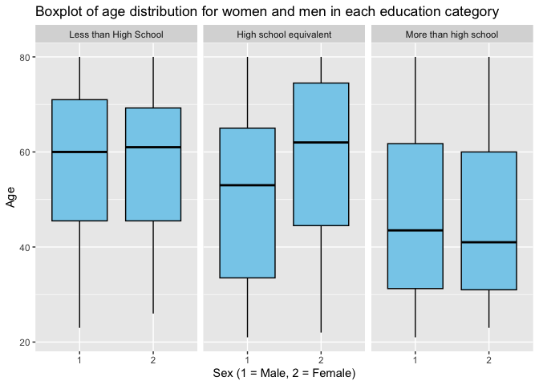

p8105_hw3_zx2482
================
Allison Xia
2023-10-11

## Problem 2

``` r
data("brfss_smart2010") 

brfss_smart2010 = 
  brfss_smart2010 |> 
  as_tibble()
```

``` r
brfss_overall_health =
  brfss_smart2010 |> 
  rename(state = Locationabbr,
         location = Locationdesc) |> 
  janitor::clean_names() |> 
  filter(topic == "Overall Health") |> 
  filter(response  %in% c("Excellent","Very good","Good","Fair","Poor")) |> 
  arrange(desc(response)) |> 
  mutate(response = ordered(response, levels = c("Poor", "Fair", "Good","Very good","Excellent"))) |> 
  arrange(response) 
```

#### In 2002, which states were observed at 7 or more locations? What about in 2010?

``` r
states_2002 <- 
  brfss_overall_health |> 
  filter(year == "2002") |> 
  group_by(state) |> 
  summarize(number_locations= n_distinct(location)) |> 
  filter(number_locations >= 7) |> 
  pull(state)

states_2010 <- 
  brfss_overall_health |> 
  filter(year == "2010") |> 
  group_by(state) |> 
    summarize(number_locations = n_distinct(location)) |> 
  filter(number_locations >= 7) |> 
  pull(state)
```

In 2002, these following states were observed at 7 or more locations:
CT, FL, MA, NC, NJ, PA. In 2010, these following states were observed at
7 or more locations: CA, CO, FL, MA, MD, NC, NE, NJ, NY, OH, PA, SC, TX,
WA

#### Construct a dataset that is limited to Excellent responses, and contains, year, state, and a variable that averages the data_value across locations within a state. Make a “spaghetti” plot of this average value over time within a state (that is, make a plot showing a line for each state across years – the geom_line geometry and group aesthetic will help).

``` r
brfss_excellent = 
  brfss_overall_health |> 
  filter(response == "Excellent") |> 
  group_by(state, year) |> 
  summarize (mean_data_value = mean(data_value, na.rm=TRUE))
```

    ## `summarise()` has grouped output by 'state'. You can override using the
    ## `.groups` argument.

``` r
ggplot(brfss_excellent, aes(x=year, y=mean_data_value, color=state)) +
  geom_line() +
  labs(title="Data average value over years within a state",
       x="Year",
       y="Mean Data Value")
```


#### Make a two-panel plot showing, for the years 2006, and 2010, distribution of data_value for responses (“Poor” to “Excellent”) among locations in NY State.

``` r
brfss_NY_responses = 
  brfss_overall_health |> 
  filter(state == "NY" & (year =="2006" | year == "2010"))
```

``` r
ggplot(brfss_NY_responses, aes(x= response, y = data_value))+
  geom_boxplot(fill="skyblue", color="black")+
  labs(title="Boxplot showing distribution of data value for responses", x="Responses", y="Data Value") +
  facet_wrap(~year)
```


## Problem 3

#### Load, tidy, merge, and otherwise organize the data sets

``` r
accelerometer = read_csv("./accelerometer.csv")
```

    ## Rows: 250 Columns: 1441
    ## ── Column specification ────────────────────────────────────────────────────────
    ## Delimiter: ","
    ## dbl (1441): SEQN, min1, min2, min3, min4, min5, min6, min7, min8, min9, min1...
    ## 
    ## ℹ Use `spec()` to retrieve the full column specification for this data.
    ## ℹ Specify the column types or set `show_col_types = FALSE` to quiet this message.

``` r
demographic = read_csv("./demographic.csv",skip =4)
```

    ## Rows: 250 Columns: 5
    ## ── Column specification ────────────────────────────────────────────────────────
    ## Delimiter: ","
    ## dbl (5): SEQN, sex, age, BMI, education
    ## 
    ## ℹ Use `spec()` to retrieve the full column specification for this data.
    ## ℹ Specify the column types or set `show_col_types = FALSE` to quiet this message.

``` r
demographic_tidy =
  demographic |> 
  janitor::clean_names() |> 
  na.omit() |> 
  filter(age >= 21) |> 
  mutate(sex = factor(sex),
         education = factor(education))
```

``` r
accelerometer_tidy=
  accelerometer |> 
  janitor::clean_names() |> 
  pivot_longer(
    min1:min1440, 
    names_to = "min",
    names_prefix = "min",
    values_to = "mims"
  )
```

``` r
nhanes = demographic_tidy |> 
  left_join(accelerometer_tidy,by = join_by(seqn))
```

#### Produce a reader-friendly table for the number of men and women in each education category, and create a visualization of the age distributions for men and women in each education category. Comment on these items

``` r
nhanes_sex_education=
  nhanes |>
  group_by(sex, education) |>
  summarize(count = n())|>
  mutate(sex = recode(sex, "1" = "Male", "2" = "Female"),
         education = recode(education, "1" = "Less than High School", "2" = "High school equivalent", "3"="More than high school"))
```

    ## `summarise()` has grouped output by 'sex'. You can override using the `.groups`
    ## argument.

``` r
nhanes_sex_education |> 
  knitr::kable(digits = 2) 
```

| sex    | education              | count |
|:-------|:-----------------------|------:|
| Male   | Less than High School  | 38880 |
| Male   | High school equivalent | 50400 |
| Male   | More than high school  | 80640 |
| Female | Less than High School  | 40320 |
| Female | High school equivalent | 33120 |
| Female | More than high school  | 84960 |

``` r
ggplot(nhanes_sex_education, aes(x=education, y=count)) +
  geom_bar(stat="identity",fill="skyblue", color="black") +
  labs(title="Barplot using ggplot2", x="Category", y="Count") +
  facet_wrap(~sex)+
  theme_minimal()
```



Both males and females have the highest count in the “More than high
school” education level. For males, the number of participants increases
with each increase in education level. For females, there are more
participants with “Less than High School” education compared to those
with a “High school equivalent”. In the “More than high school”
category, females (84960) slightly outnumber males (80640). In contrast,
males (50400) have more participants than females (33120) in the “High
school equivalent” category.
